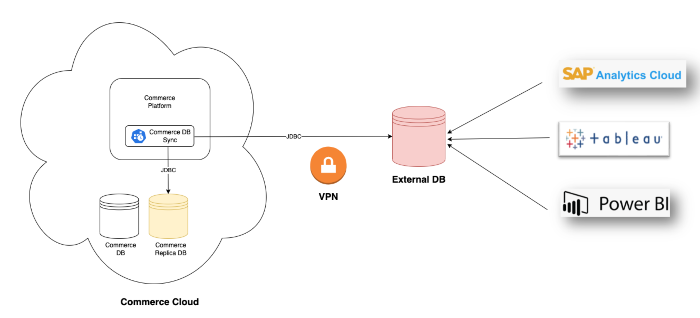

# SAP Commerce DB Sync

SAP Commerce DB Sync performs table-to-table replication in single-directionally manner between two SAP Commerce instances (onPrem to Cloud) or between SAP Commerce and an external database.

SAP Commerce DB Sync is implemented as SAP Commerce extensions and it does not require any third-party ETL.

There are two main use cases:
* __Replicate data across an external database__: you can push data regularly in batch mode through a Commerce Cloud cronjob and synchronize to an external database. A typical use case is for analytics and reporting purpose when you need direct JDBC access to the database to run analytic jobs.

* __Data migration__: paired with the self-service media process described on [this CXWorks article](https://www.sap.com/cxworks/article/2589632453/migrate_to_sap_commerce_cloud_migrate_media_with_azcopy), it allows to self-service a one-shot data migration from the on-premise SAP Commerce environment to a SAP Commerce Cloud subscription.

# Getting started

* [User Guide for Data Replication](docs/user/USER-GUIDE-DATA-REPLICATION.md) Go through the details about Data replication between SAP Commerce Cloud and an external database. 
* [User Guide for Data Migration](docs/user/USER-GUIDE-DATA-MIGRATION.md) When ready to start the migration activities, follow the instructions in the User Guide to trigger the data migration.
* [Demo video](https://sapvideoa35699dc5.hana.ondemand.com/?entry_id=1_gxduwrl3) on how to use SAP Commerce DB sync (formerly known as CMT) for data migration from onPrem to Cloud.
* [Configuration Guide](docs/configuration/CONFIGURATION-GUIDE.md) The extensions ship with a default configuration that may need to be adjusted depending on the desired behaviour. This guide explains how different features and behaviours can be configured.
* [Security Guide](docs/security/SECURITY-GUIDE.md) A data migration typically features sensitive data and uses delicate system access. Make sure you have read the Security Guide before you proceed with any migration activities and thereby acknowledge the security recommendations stated in the guide.
* [Performance Guide](docs/performance/PERFORMANCE-GUIDE.md) Performance is crucial for any data migration, not only for large databases but also generally to reduce the time of the cut-over window. The performance guide explains the basic concept of performance tuning and also provides benchmarks that will give you an impression of how to estimate the cutover time window.
* [Developer Guide](docs/developer/DEVELOPER-GUIDE.md) If you want to contribute please read this guide.
* [Troubleshooting Guide](docs/troubleshooting/TROUBLESHOOTING-GUIDE.md) A collection of common problems and how to tackle them.

# Features Overview

* Database Connectivity
  * Multipe supported databases: Oracle, MySQL, HANA, MSSQL
  * UI based connection validation
* Schema Differences
  * UI based schema differences detector
  * Automated target schema adaption
    * Table creation / removal
    * Column creation / removal
  * Configurable behaviour
* Data Copy
  * UI based copy trigger
  * Configurable target table truncation
  * Configurable index disabling
  * Read/write batching with configurable sizes
  * Copy parallelization
  * Cluster awareness
  * Column exclusions
  * Table exclusions/inclusions
  * Incremental mode (delta)
  * Custom tables
  * Staged approach using table prefix
* Reporting / Audit
  * Automated reporting for schema changes
  * Automated reporting for copy processes
  * Stored on blob storage
  * Logging of all actions triggered from the UI

# Requirements

  * SAP Commerce (>=1811)
  * Tested with source databases:
    * Azure SQL
    * MySQL (5.7)
    * Oracle (XE 11g)
    * HANA (express 2.0) and HANA Cloud
  * Tested with target databases:
    * Azure SQL
    * Oracle (XE 11g)
    * HANA (express 2.0) and HANA Cloud

# Performance

Commerce DB Sync has been built to offer reasonable performance with large amount of data using the following design: 
* Table to table replication using JDBC (low level)
* Selection of tables so we do not need a full synchronization in particular for large technical table (task logs, audit logs...)​
* Multi-threaded and can manage multiple tables at the same time ​
* Using UPSERT (INSERT/UPDATE)
* Use read replica Commerce database as a source database

# Disclaimer

Commerce DB Sync uses direct JDBC access to Commerce Cloud database. This access may be restricted in the future for customers.

# How to Obtain Support

This repository is provided "as-is"; **SAP does not provide any additional support**.

SAP Services team is the creator and main contributor to SAP Commerce DB Sync, the team can provide assistance as a paid engagement. If you plan to setup SAP Commerce DB Sync for your project, we highly recommend involving SAP Services to ensure a successful implementation.

# Contributing
Want to contribute? Check out our [Contributing document](CONTRIBUTING.md) and follow our [code of conduct](CODE_OF_CONDUCT.md).

# License
Copyright (c) 2022 SAP SE or an SAP affiliate company. All rights reserved. This project is licensed under the Apache Software License, version 2.0 except as noted otherwise in the [LICENSE file](LICENSE).
