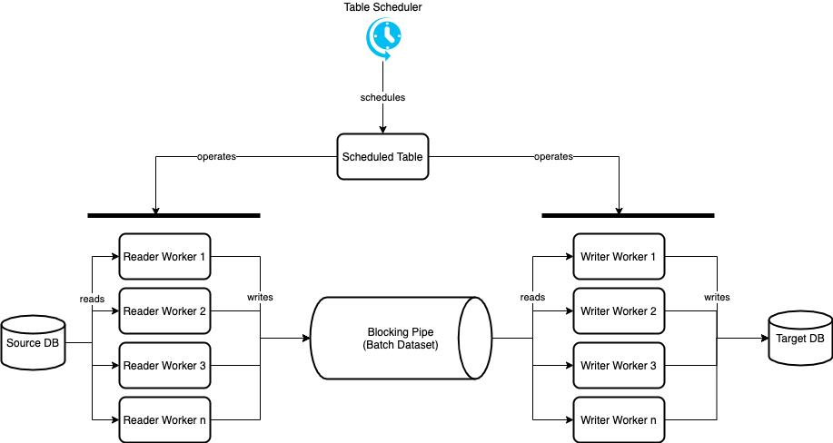

# SAP Commerce DB Sync - Performance Guide

## Benchmarks

### AWS to SAP Commerce Cloud

Source Database:

* AWS Mysql: db.m6g.large
* Tables: 974
* Row Count: 158'855'795
* Total Volume at source (incl. Indexes): 51 GB

Results:

| Tier | Mem | CPU | Duration | parTables | rWorkers | wWorkers | batchSize | disIdx | DB size at target |
|------|-----|-----|----------|-----------|----------|----------|-----------|--------|-------------------|
| S12  | 4GB | 2   | 2h11m    | 2         | 5        | 15       | 2000      | TRUE   | 72GB              |
| S12  | 4GB | 2   | 3h4m     | 2         | 5        | 15       | 2000      | FALSE  | 92GB              |
| S12  | 4GB | 2   | 2h59m    | 2         | 5        | 15       | 4000      | FALSE  | 92GB              |
| S12  | 6GB | 2   | 2h53m    | 2         | 10       | 20       | 3000      | FALSE  | 92GB              |
| S12  | 6GB | 2   | 2h09m    | 2         | 5        | 15       | 3000      | TRUE   | 72GB              |
| S12  | 6GB | 6   | 1h35m    | 2         | 5        | 15       | 3000      | TRUE   | 72GB              |
| S12  | 8GB | 6   | 1h30m    | 2         | 10       | 30       | 3000      | TRUE   | 75GB              |

> **NOTE**: DB size differs in source and target due to different storage concepts (indexes).

## Technical Concept

### Scheduler

The table scheduler is responsible for triggering the copy process for each table.
The set of tables the scheduler actually works with is based on the copy item provider and the respective filters configured. How many tables can be scheduled in parallel is determined by the following property:

`migration.data.maxparalleltablecopy`

### Reader Workers

Each scheduled table will get a set of reader workers. The source table will be read using the 'keyset/seek' pagination, if possible. For this, a unique key will be identified (typically 'PK' or 'ID') and out of this the parallel batches can be determined. In case this is not possible, the readers will fall back to offset pagination.
Each reader worker is using its own db connection.
How many reader workers a table can have is defined by the following property:

`migration.data.workers.reader.maxtasks`

The size of the batches each reader will query depends on the following property:

`migration.data.reader.batchsize`

### Blocking Pipe

The batches read by the reader workers will be written to a blocking pipe as wrapped datasets.
The pipe is a blocking queue that can be used to throttle the throughput and is configurable in this way:

`migration.data.pipe.timeout`

`migration.data.pipe.capacity`

The pipe will throw an exception if it has been blocked for too long (maybe because the writers are too slow).
Default value for the timeout should be enough though.
If the pipe is running full by reaching the max capacity, it will block and wait until the writers free-up space in it.

### Writer Workers

The writers will read from the pipe until the pipe is sealed. Each dataset will then be written to the database in a prepared statement / batch insert way. Each writer batch is using its own db connection and transaction (one commit per batch). In case the batch insert fails, a rollback happens.
How many writer workers a table can have is defined by the following property:

`migration.data.workers.writer.maxtasks`

The batch size for the writers is bound to the readers batch size.

## Perfomance Tuning

### Degree of Parallelization

In most cases there are a lot of small tables and few very large tables. This leads to the fact that the duration of the overall migration mostly depends on these large tables. Increasing the number of parallel tables won't help to speed up large tables, instead the number workers should be increased. The workers influence how fast a single table can be migrated, since the more workers there are the more batches of the large table can be executed in parallel. Therefore, it makes sense to reduce the parallel tables to a rather low number to save resources on the infrastructure and in turn use the resources for increased batch parallelisation in the large tables.

How many workers for both readers and writer should be set, depends on the power of the involved databases and the underlying infrastructure.
Since reading is typically faster than writing a ratio of 1:3 (3 writer workers for 1 one reader worker) should be ok.
Have a look at the benchmarks to see how far you can go with the parallelisation.
Keep in mind that processing 2 tables in parallel already leads to `2 * rWorkers + 2 * wWorkers` threads / connections in total.

### Memory & CPU

By increasing the parallelization degree you can easily overload the system, which may lead to out of memory.

> **NOTE**: On SAP Commerce Cloud, an out of memory exception can sometimes be hidden. Typically you know you were running out of memory if the pod (backoffice) immediately shuts down or restarts without further notice (related to SAP Commerce Cloud health checks).

Have a close look at the memory metrics and make sure it is in a healthy range throughout the copy process.
To solve memory issues, either decrease the degree of parallelization or reduce the capacity of the data pipe as such.

### DB Connections

Some properties may impact each other which can lead to side effects.

Given:

`migration.data.maxparalleltablecopy`

`migration.data.workers.reader.maxtasks`

`migration.data.workers.writer.maxtasks`

`migration.ds.source.db.connection.pool.size.active.max`

`migration.ds.target.db.connection.pool.size.active.max`

The amount of database connections can be defined as follows:

`#[dbconnectionstarget] >= #[maxparalleltablecopy] * #[maxwritertasks]`

`#[dbconnectionssource] >= #[maxparalleltablecopy] * #[maxreadertasks]`

### Disabling Indexes

Indexes can be a bottleneck when inserting batches.
MS SQL Server offers a way to temporarily disable indexes during the copy process.
This can be done using the property:

`migration.data.indices.disable.enabled`

This will disable the indexes on a table right before it starts the copy. Once finished, the they will be rebuilt again.

> **NOTE**: Re-enabling the indexes itself may take quite some time for large tables and this may temporarily slow down and lock the copy process.

> **NOTE**: Disabling the indexes can have the unwanted side effect that duplicate key inserts won't be detected and reported. Therefore only do this if you are sure that no duplicates are around.
