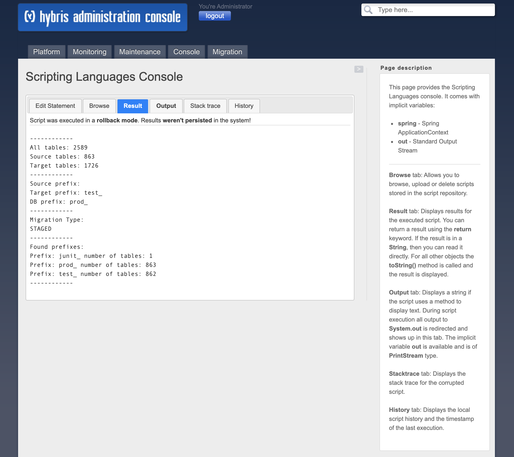

# Commerce Database Sync - Support Guide

Here you can find some guidelines for members of Cloud Support Team.

## Staged migration approach

In order to display a summary of source and target schemas, you can utilize following groovy script:

``groovy/MigrationSummaryScript.groovy``

Or else copy the script from here:

```
package groovy

import de.hybris.platform.util.Config
import org.apache.commons.lang.StringUtils

import java.util.stream.Collectors

def result = generateMigrationSummary(migrationContext)
println result
return result

def generateMigrationSummary(context) {
    StringBuilder sb = new StringBuilder();
    try {
        final String sourcePrefix = context.getDataSourceRepository().getDataSourceConfiguration().getTablePrefix();
        final String targetPrefix = context.getDataTargetRepository().getDataSourceConfiguration().getTablePrefix();
        final String dbPrefix = Config.getString("db.tableprefix", "");
        final Set<String> sourceSet = migrationContext.getDataSourceRepository().getAllTableNames()
                .stream()
                .map({ tableName -> tableName.replace(sourcePrefix, "") })
                .collect(Collectors.toSet());

        final Set<String> targetSet =  migrationContext.getDataTargetRepository().getAllTableNames()
        sb.append("------------").append("\n")
        sb.append("All tables: ").append(sourceSet.size() + targetSet.size()).append("\n")
        sb.append("Source tables: ").append(sourceSet.size()).append("\n")
        sb.append("Target tables: ").append(targetSet.size()).append("\n")
        sb.append("------------").append("\n")
        sb.append("Source prefix: ").append(sourcePrefix).append("\n")
        sb.append("Target prefix: ").append(targetPrefix).append("\n")
        sb.append("DB prefix: ").append(dbPrefix).append("\n")
        sb.append("------------").append("\n")
        sb.append("Migration Type: ").append("\n")
        sb.append(StringUtils.isNotEmpty(dbPrefix) &&
                StringUtils.isNotEmpty(targetPrefix) && !StringUtils.equalsIgnoreCase(dbPrefix, targetPrefix) ? "STAGED" : "DIRECT").append("\n")
        sb.append("------------").append("\n")
        sb.append("Found prefixes:").append("\n")

        Map<String, Long> prefixes = new HashMap<>()
        targetSet.forEach({ tableName ->
            String srcTable = schemaDifferenceService.findCorrespondingSrcTable(sourceSet, tableName);
            String prefix = tableName.replace(srcTable, "");
            prefixes.put(prefix, targetSet.stream().filter({ e -> e.startsWith(prefix) }).count());
        });
        prefixes.forEach({ k, v -> sb.append("Prefix: ").append(k).append(" number of tables: ").append(v).append("\n") });
        sb.append("------------").append("\n");

    } catch (Exception e) {
        e.printStackTrace();
    }
    return sb.toString();
}


```

It prints information as follows:
* total number of all tables (source + target)
* number of source tables
* number of target tables
* prefixes defined as property (source, target & current database schema)
* all detected prefixes in target database with the number of tables

You can use this information to remove staged tables generated during data migration process.

 
