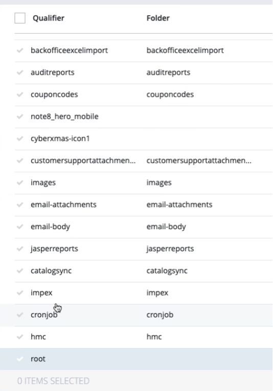

# DB View Usage for DB Synchronisation

Views can be used for simple preparation of data and their transformation on DB side.
The idea is to provide possibility to create and read views on source DB instead original table.
View may have data from some columns prepared for copying to another environment.
Data can be hashed, scrambled, or transformed that way as customer need.

View should exist on source DB side and not to be copied to target DB.

# Local Setup for Test Environment

# Prerequisites

In order to follow below steps you need to have docker installed.

## Docker Test Environment

If you have Docker or Rancher Desktop or any other solution available, please skip next chapter and start with [Local Environment Setup](#local-environment-setup).

### Colima as Docker alternative

Docker Desktop currently requires a license, that is why it is recommended to use Colima to setup environment. Apart of that it is required to have CLI available, that is why we do install `docker` and `docker-compose`.

```bash
brew install colima docker docker-compose
colima start # docker engine alternative
```

### Uninstall QEMU & Lima

In case of issues with local environment, please follow steps from here: https://gist.github.com/toricls/d3dd0bec7d4c6ddbcf2d25f211e8cd7b

```bash
# !! CAUTION !!
# This document assumes the below paths that you've installed by following https://gist.github.com/toricls/d3dd0bec7d4c6ddbcf2d25f211e8cd7b#1-install-patched-qemu
$ sudo rm -f /usr/local/bin/{lima,limactl,nerdctl}
$ sudo rm -rf /usr/local/share/lima
$ sudo rm -f /usr/local/bin/{qemu-edid,qemu-ga,qemu-img,qemu-io,qemu-nbd,qemu-storage-daemon,qemu-system-aarch64}
```

# Local Environment Setup

To validate sync with MS SQL we have used `docker-compose` configuration with `Azurite`. It is required to run below commands in same directory where our [docker-compose.yml](./docker-compose.yml) is located.

```bash
docker-compose up
```

It will create 2 MS SQL instances for source and target repository required for db sync. Aside there is `Azurite` running as db-sync requires it for storing synchronization report.

## Manual Data import

Due to having Mac M1 there is no `sqlcmd` available in container and all data have been imported manually from `Azure Data Studio` using test data.
To initialize DB please run content from files [source.sql](./sql/source.sql) and [target.sql](./sql/target.sql).
On top of that, please import data from following files [sqlserver.sql](./sql/sqlserver.sql) and [sqlserver-data.sql](./sql/sqlserver-data.sql).

These are data which are not related to CX Commerce data system. That is related to support corner case when there is more tables aside Commerce ones.

### Commerce Data Generation

Source database has to be used as main database for CX Commerce, therefore it is required to add that configuration to your `local.properties`

```properties
# default DB
db.driver=com.microsoft.sqlserver.jdbc.SQLServerDriver
db.url=jdbc:sqlserver://localhost:6433;databaseName=source;responseBuffering=adaptive;loginTimeout=10
db.username=sa
db.password=Passw0rd
db.schema=dbo

# commerce DB sync settings
# for source DB
migration.ds.source.db.driver=com.microsoft.sqlserver.jdbc.SQLServerDriver
migration.ds.source.db.url=jdbc:sqlserver://localhost:6433;databaseName=source;responseBuffering=adaptive;loginTimeout=10
migration.ds.source.db.username=sa
migration.ds.source.db.password=Passw0rd
migration.ds.source.db.schema=dbo

# for target DB
migration.ds.target.db.driver=com.microsoft.sqlserver.jdbc.SQLServerDriver
migration.ds.target.db.url=jdbc:sqlserver://localhost:7433;databaseName=target;responseBuffering=adaptive;loginTimeout=10
migration.ds.target.db.username=sa
migration.ds.target.db.password=Passw0rd
migration.ds.target.db.schema=dbo

# Azurite for DB sync reports
migration.data.report.connectionstring=DefaultEndpointsProtocol=http;AccountName=devstoreaccount1;AccountKey=Eby8vdM02xNOcqFlqUwJPLlmEtlCDXJ1OUzFT50uSRZ6IFsuFq2UVErCz4I6tq/K1SZFPTOtr/KBHBeksoGMGw==;BlobEndpoint=http://127.0.0.1:10000/devstoreaccount1;QueueEndpoint=http://127.0.0.1:10001/devstoreaccount1;TableEndpoint=http://127.0.0.1:10002/devstoreaccount1;

# Commerce initialize admin password
initialpassword.admin=nimda
```

Add to `localextensions.xml` following extensions:

```xml
<extension name="backoffice" />
<extension name="commercedbsync" />
<extension name="commercedbsynchac" />
<extension name="commercedbsynctest" />
```

Then you can run `ant initialize`.

> NOTE
> DB Migration cannot be set that source DB is main DB for running CX Commerce instance. Source table cannot be host CCv2 MS SQL DB.

> You have to initialize `source` database to have CX Commerce system tables, otherwise it will raise an error during migration process.
> You have to now change DB again, to have other system database, because runtime main database has to be different than `source`.

We do change configuration again in `local.properties`.

```properties
# default DB
db.driver=com.microsoft.sqlserver.jdbc.SQLServerDriver
db.url=jdbc:sqlserver://localhost:6433;databaseName=hybris;responseBuffering=adaptive;loginTimeout=10
db.username=sa
db.password=Passw0rd
db.schema=dbo
```

Then you can run `ant initialize` again.

After initialization it is possible to login to `/hac` with credentials `admin/nimda`.

# DB Sync Analysis

DB Sync consists of 2 steps related to different kind of data operations:

- DDL - Schema Generation
- DML - Data Migration

Views should exist only on source DB and being treated as origin source table instead item type one.
Schema Migration process should create table with same structure as we have in source item type table.
Let's assume that we would like to scramble user password in table `users`.
We have to create a view and name it with particular naming convention, e.g. `%s_view`, then we create a view, where we have same amount of columns as in origin item type table `users`. Value for password will be replaced by string `xxx`.

```sql
CREATE OR ALTER VIEW users_view
AS
SELECT p_name,p_uid,... 'xxx' as passwd,'none' as p_passwordanswer,'empty' as p_passwordquestion, p_sessionlanguage,... FROM users
```

Then we receive on target DB data, which can be accessible for Data Analysts for further transformation or processing.

It is required to review 2 steps: schema creation and data migration if that customization is possible.

## Schema Migration Analysis

```java
// CommercemigrationhacController
    @RequestMapping(value =
            {"/previewSchemaMigration"}, method =
            {org.springframework.web.bind.annotation.RequestMethod.GET})
    @ResponseBody
    public SchemaDifferenceResultContainerData previewSchemaMigration() throws Exception {
```

Schema generation skips custom tables. All data from [sqlserver.sql](./sql/sqlserver.sql) file were ignored. custom item type views were also ignored. Only CX Commerce system tables are taken into consideration and DDL for `users` table has been created same way as on `source` DB.

> **Note**
> Original schema generation works fine and will not collide with view, nor will include view to target database.

## Data Migration Analysis

The main service `DefaultDatabaseMigrationService` can be called from:

- cronJob: `FullMigrationJob` or `IncrementalMigrationJob`
- controller: `CommercemigrationhacController.copyData()`

Then top-down call trace is: `CommercemigrationhacController` -> `DefaultDatabaseMigrationService.startMigration()` -> `DefaultDatabaseMigrationService.buildCopyContext()` -> `DefaultDataCopyItemProvider.get()` where provider is responsible for building `CopyContext`, where source table is mapped to target table.

Migration is tightly coupled to `MigrationContext` instance, which is global one and filled dynamically.

> context has to be extended by information related if view should be included in search or not. that should be boolean flag
> context should be aware of configuration of view naming pattern.

```java
// in MigrationContext interface
	/**
	 * Boolean flag which defines if in migration process there should be done a
	 * lookup for View for particular item type table. If view is matching item type
	 * view name pattern, then that view will be used instead table just for a data.
	 *
	 * @return by default {@code false}, if true, view will be used for fetching
	 *         data instead table. that will allow possibility to
	 *         mask/exclude/scramble some data on table level.
	 */
	boolean isItemTypeViewLookupEnabled();

	/**
	 * String value which defines name of the view which should be looked up in
	 * database and check if matches by name. String pattern should be compatible
	 * with {@code String.format()} pattern.
	 * E.g.<br>
	 * <pre>
	 * String pattern    : "%s_view"
	 * item type table   :  "products"
	 * Searched view name: "products_view"
	 * </pre>
	 *
	 * @return
	 */
	String getItemTypeViewNamePattern();
```

There have been created 2 constants which will be used to set these values:

```java
// in CommercedbsyncConstants
	// DB View support
    public static final String MIGRATION_DB_VIEW_ENABLED = "migration.data.view.enabled";
    public static final String MIGRATION_DB_VIEW_NAME_PATTERN = "migration.data.view.name.pattern";
```

These values are used in default implementation of `MigrationContext` interface, in `DefaultMigrationContext`.

Following the migration process we have found possible place where table name could be replaced by view name.

As it was mentioned `DefaultDataCopyItemProvider.get()` is responsible for building `CopyContext`. That is why it is recommended to review private method:

```java
private CopyContext.DataCopyItem createCopyItem(final MigrationContext context, final TableCandidate sourceTable,
		final TableCandidate targetTable) {
	final String sourceTableName = sourceTable.getFullTableName();
	final String targetTableName = targetTable.getFullTableName();
	// TODO 3 check if given table candidate has a view
	final CopyContext.DataCopyItem dataCopyItem = new CopyContext.DataCopyItem(sourceTableName, targetTableName);
	addColumnMappingsIfNecessary(context, sourceTable, dataCopyItem);
	return dataCopyItem;
```

and replace `TODO` with code where view pattern will be taken from `MigrationContext` and checked if exists in `source` DB.

## Data Migration for Media Item Type

Customers with massive media data can limit volume by filtering out by e.g. `MediaFolder` item type.



It's possible to do that by views. Media view has to follow naming pattern from `migration.db.view.name.pattern`.

### Getting DDL Table Structure

View structure has to provide 1:1 columns to original table. To get list of all columns it is recommended to use HAC and functionality for SQL Script generation by going in menu: `Platform` -> `SQL Scripts` and select option `Generate scripts for initialization`. When generation is completed, `Download all scripts in zip file` and find `medias` table in file: `init_master_schema.sql`.

default DDL for medias looks like below:

```sql
CREATE TABLE medias
(
    hjmpTS BIGINT,
    createdTS DATETIME2,
    modifiedTS DATETIME2,
    TypePkString BIGINT,
    OwnerPkString BIGINT,
    PK BIGINT NOT NULL,
    sealed TINYINT,
    p_mime NVARCHAR(255),
    p_size BIGINT,
    p_datapk BIGINT,
    p_location NVARCHAR(MAX),
    p_locationhash NVARCHAR(255),
    p_realfilename NVARCHAR(255),
    p_code NVARCHAR(255),
    p_internalurl NVARCHAR(MAX),
    p_description NVARCHAR(255),
    p_alttext NVARCHAR(255),
    p_removable TINYINT,
    p_mediaformat BIGINT,
    p_folder BIGINT,
    p_subfolderpath NVARCHAR(255),
    p_mediacontainer BIGINT,
    p_catalog BIGINT,
    p_catalogversion BIGINT,
    aCLTS BIGINT DEFAULT 0,
    propTS BIGINT DEFAULT 0,
    p_outputmimetype NVARCHAR(255),
    p_inputmimetype NVARCHAR(255),
    p_itemtimestamp DATETIME2,
    p_format BIGINT,
    p_sourceitem BIGINT,
    p_fieldseparator CHAR(4),
    p_quotecharacter CHAR(4),
    p_commentcharacter CHAR(4),
    p_encoding BIGINT,
    p_linestoskip INTEGER,
    p_removeonsuccess TINYINT,
    p_zipentry NVARCHAR(255),
    p_extractionid NVARCHAR(255),
    p_auditrootitem BIGINT,
    p_auditreportconfig BIGINT,
    p_scheduledcount INTEGER,
    p_cronjobpos INTEGER,
    p_cronjob BIGINT,
    PRIMARY KEY (PK)
);
```

Based on that you can create a view:

```sql
CREATE OR ALTER VIEW v_medias
AS
SELECT
    hjmpTS,
    createdTS,
    modifiedTS,
    TypePkString,
    OwnerPkString,
    PK,
    sealed,
    p_mime,
    p_size,
    p_datapk,
    p_location,
    p_locationhash,
    p_realfilename,
    p_code,
    p_internalurl,
    p_description,
    p_alttext,
    p_removable,
    p_mediaformat,
    p_folder,
    p_subfolderpath,
    p_mediacontainer,
    p_catalog,
    p_catalogversion,
    aCLTS,
    propTS,
    p_outputmimetype,
    p_inputmimetype,
    p_itemtimestamp,
    p_format,
    p_sourceitem,
    p_fieldseparator,
    p_quotecharacter,
    p_commentcharacter,
    p_encoding,
    p_linestoskip,
    p_removeonsuccess,
    p_zipentry,
    p_extractionid,
    p_auditrootitem,
    p_auditreportconfig,
    p_scheduledcount,
    p_cronjobpos,
    p_cronjob
FROM medias
```

### Getting MediaFolder filtering

To filter our by `Media` items by `MediaFolder` qualifier it is best to use `/hac` and `FlexibleSearch` console.

```sql
-- flexible search
-- filtering "MediaFolder" by name = "images"
select {pk} FROM {MediaFolder} where {qualifier} like 'images'
-- will produce SQL Query
SELECT  item_t0.p_qualifier  FROM mediafolders item_t0 WHERE ( item_t0.p_qualifier  like 'images') AND (item_t0.TypePkString=? )
-- we can skip "TypePkString" for that case
SELECT  item_t0.PK  FROM mediafolders item_t0 WHERE ( item_t0.p_qualifier  like 'images')
```

Now we need to join it with your `medias` table:

```sql
-- flexible search
select {m.pk} FROM {Media AS m JOIN MediaFolder AS mf ON {m.folder} = {mf.pk}} where {mf.qualifier} like 'images'
-- will produce SQL Query in second tab:
SELECT  item_t0.PK  FROM medias item_t0 JOIN mediafolders item_t1 ON  item_t0.p_folder  =  item_t1.PK  WHERE ( item_t1.p_qualifier  like 'images') AND ((item_t0.TypePkString IN  (?,?,?,?,?,?,?,?,?,?,?,?,?,?,?,?,?,?,?,?,?,?,?,?)  AND item_t1.TypePkString=? ))
-- we can skip "TypePkString" for that case too
SELECT  item_t0.PK  FROM medias item_t0 JOIN mediafolders item_t1 ON  item_t0.p_folder  =  item_t1.PK  WHERE ( item_t1.p_qualifier  like 'images')
```

> **Note**
>
> If there is a strong need to include `TypePkString` filtering, take a look for required values in tab: "Execution statistics". You will find PK values there for all required parameters.

Given filtering we can adjust to view definition. Keep in mind to include table alias for all columns:

```sql
CREATE OR ALTER VIEW v_medias
AS
SELECT
    item_t0.hjmpTS,
    item_t0.createdTS,
    item_t0.modifiedTS,
    item_t0.TypePkString,
    item_t0.OwnerPkString,
    item_t0.PK,
    item_t0.sealed,
    item_t0.p_mime,
    item_t0.p_size,
    item_t0.p_datapk,
    item_t0.p_location,
    item_t0.p_locationhash,
    item_t0.p_realfilename,
    item_t0.p_code,
    item_t0.p_internalurl,
    item_t0.p_description,
    item_t0.p_alttext,
    item_t0.p_removable,
    item_t0.p_mediaformat,
    item_t0.p_folder,
    item_t0.p_subfolderpath,
    item_t0.p_mediacontainer,
    item_t0.p_catalog,
    item_t0.p_catalogversion,
    item_t0.aCLTS,
    item_t0.propTS,
    item_t0.p_outputmimetype,
    item_t0.p_inputmimetype,
    item_t0.p_itemtimestamp,
    item_t0.p_format,
    item_t0.p_sourceitem,
    item_t0.p_fieldseparator,
    item_t0.p_quotecharacter,
    item_t0.p_commentcharacter,
    item_t0.p_encoding,
    item_t0.p_linestoskip,
    item_t0.p_removeonsuccess,
    item_t0.p_zipentry,
    item_t0.p_extractionid,
    item_t0.p_auditrootitem,
    item_t0.p_auditreportconfig,
    item_t0.p_scheduledcount,
    item_t0.p_cronjobpos,
    item_t0.p_cronjob
FROM medias item_t0 JOIN mediafolders item_t1 ON  item_t0.p_folder  =  item_t1.PK  WHERE ( item_t1.p_qualifier  like 'images')
```

# Alternative to View Approach

## Azure SQL Dynamic Masking

Azure provides feature for data masking, which is possible to add on table creation/manipulation DDL.
That is not supported in platform as it would require tight coupling to DB vendor and limiting other vendors as it is unique to MS SQL.
Azure SQL [Dynamic Data Masking](https://learn.microsoft.com/en-us/sql/relational-databases/security/dynamic-data-masking?view=sql-server-ver16) provides few functions for data masking:

- Default - it will replace value with 'XXXX' string for text values.
- email - it will show first letter of an email, mask rest and leave ".com" at the end
- random - for any numeric values for specified range
- custom - masking method that exposes the first and last letters and adds a custom padding string in the middle. prefix,[padding],suffix

There is possible to create custom functions to support data masking. We have 2 replacements for these functions:

- [custom](./sql/custom-function.sql)
- [email](./sql/email-function.sql)

```sql
CREATE OR ALTER VIEW v_medias
AS
SELECT
    item_t0.hjmpTS,
    item_t0.createdTS,
    item_t0.modifiedTS,
    item_t0.TypePkString,
    item_t0.OwnerPkString,
    item_t0.PK,
    item_t0.sealed,
    item_t0.p_mime,
    item_t0.p_size,
    mask_email(item_t0.p_datapk), -- example how to use email masking function
    mask_custom(1, 'xxxxx', 2, item_t0.p_location) -- example how to use custom masking function
    item_t0.p_locationhash,
    item_t0.p_realfilename,
    item_t0.p_code,
    item_t0.p_internalurl,
    item_t0.p_description,
    item_t0.p_alttext,
    item_t0.p_removable,
    item_t0.p_mediaformat,
    item_t0.p_folder,
    item_t0.p_subfolderpath,
    item_t0.p_mediacontainer,
    item_t0.p_catalog,
    item_t0.p_catalogversion,
    item_t0.aCLTS,
    item_t0.propTS,
    item_t0.p_outputmimetype,
    item_t0.p_inputmimetype,
    item_t0.p_itemtimestamp,
    item_t0.p_format,
    item_t0.p_sourceitem,
    item_t0.p_fieldseparator,
    item_t0.p_quotecharacter,
    item_t0.p_commentcharacter,
    item_t0.p_encoding,
    item_t0.p_linestoskip,
    item_t0.p_removeonsuccess,
    item_t0.p_zipentry,
    item_t0.p_extractionid,
    item_t0.p_auditrootitem,
    item_t0.p_auditreportconfig,
    item_t0.p_scheduledcount,
    item_t0.p_cronjobpos,
    item_t0.p_cronjob
FROM medias item_t0 JOIN mediafolders item_t1 ON  item_t0.p_folder  =  item_t1.PK  WHERE ( item_t1.p_qualifier  like 'images')
```

# Dynamic View Generation

It is possible to automatically generate a view for a table without explicitly designing DDL `VIEW` definition.
Using dynamic configuration definition in your `*.properties` Commerce configuration it is possible to generate a view.

View generation is optional. By default, it is not enabled. To generate that for the particular table it is required to create the property:

```properties
migration.data.view.t.{table}.enabled=true

# for example
migration.data.view.t.medias.enabled=true
```

That property enables the system will generate the default structure of the view

```sql
CREATE OR ALTER VIEW v_medias -- view name is generated based on other property `migration.db.view.name.pattern`
AS
SELECT * FROM medias
```

## Customize Source of Data/Table

By default, migration aims to transfer data one-to-one table by table, without transforming or fetching data from other tables.
Although sometimes it is required to filter out data as we did in the example above. That is also possible with configuration.

For example with media filtered just for the images folder is possible to achieve by below 3 properties:

```properties
migration.data.view.t.medias.enabled=true # enable view generation
# name `v_medias` is generated due to default name pattern value v_%s. No need to configure
migration.data.view.t.medias.joinWhereClause=FROM medias JOIN mediafolders item_t1 ON p_folder = item_t1.PK WHERE (item_t1.p_qualifier like 'images')
```

Output for that will be like this:

```sql
CREATE OR ALTER VIEW v_medias
AS
SELECT
    hjmpTS,
    createdTS,
    modifiedTS,
    TypePkString,
    OwnerPkString,
    PK,
    sealed,
    p_mime,
    p_size,
    p_datapk,
    p_location,
    p_locationhash,
    p_realfilename,
    p_code,
    p_internalurl,
    p_description,
    p_alttext,
    p_removable,
    p_mediaformat,
    p_folder,
    p_subfolderpath,
    p_mediacontainer,
    p_catalog,
    p_catalogversion,
    aCLTS,
    propTS,
    p_outputmimetype,
    p_inputmimetype,
    p_itemtimestamp,
    p_format,
    p_sourceitem,
    p_fieldseparator,
    p_quotecharacter,
    p_commentcharacter,
    p_encoding,
    p_linestoskip,
    p_removeonsuccess,
    p_zipentry,
    p_extractionid,
    p_auditrootitem,
    p_auditreportconfig,
    p_scheduledcount,
    p_cronjobpos,
    p_cronjob
FROM medias JOIN mediafolders item_t1 ON p_folder = item_t1.PK WHERE (item_t1.p_qualifier like 'images')
```

With the above example, we were able to extract 1:1 data from the table limiting the number of rows to media, which are related to folder with id `images`.

## Customize Columns in View

Additional functionality introduced above is the possibility to use custom functions to e.g. obfuscate values for columns, but that function can be anything, e.g. date `GETDATE()`.

For that it is possible to use an additional parameter, which is column customisation:

```properties
migration.data.view.t.{table}.columnTransformation.{column}=<value>

# e.g. replace for the table: medias, column: p_datapk, by: mask_email(p_datapk)
migration.data.view.t.medias.columnTransformation.p_datapk=mask_email(p_datapk)

# replace for table: medias, column: p_location, by: mask_custom(1, 'xxxxx', 2, p_location)
migration.data.view.t.medias.columnTransformation.p_location=mask_custom(1, 'xxxxx', 2, p_location)
```

With only these values, the view will look like the one below:

```sql
CREATE OR ALTER VIEW v_medias
AS
SELECT
    hjmpTS,
    createdTS,
    modifiedTS,
    TypePkString,
    OwnerPkString,
    PK,
    sealed,
    p_mime,
    p_size,
    mask_email(p_datapk) as p_datapk,
    mask_custom(1, 'xxxxx', 2, p_location) as p_location,
    p_locationhash,
    p_realfilename,
    p_code,
    p_internalurl,
    p_description,
    p_alttext,
    p_removable,
    p_mediaformat,
    p_folder,
    p_subfolderpath,
    p_mediacontainer,
    p_catalog,
    p_catalogversion,
    aCLTS,
    propTS,
    p_outputmimetype,
    p_inputmimetype,
    p_itemtimestamp,
    p_format,
    p_sourceitem,
    p_fieldseparator,
    p_quotecharacter,
    p_commentcharacter,
    p_encoding,
    p_linestoskip,
    p_removeonsuccess,
    p_zipentry,
    p_extractionid,
    p_auditrootitem,
    p_auditreportconfig,
    p_scheduledcount,
    p_cronjobpos,
    p_cronjob
FROM medias
```
