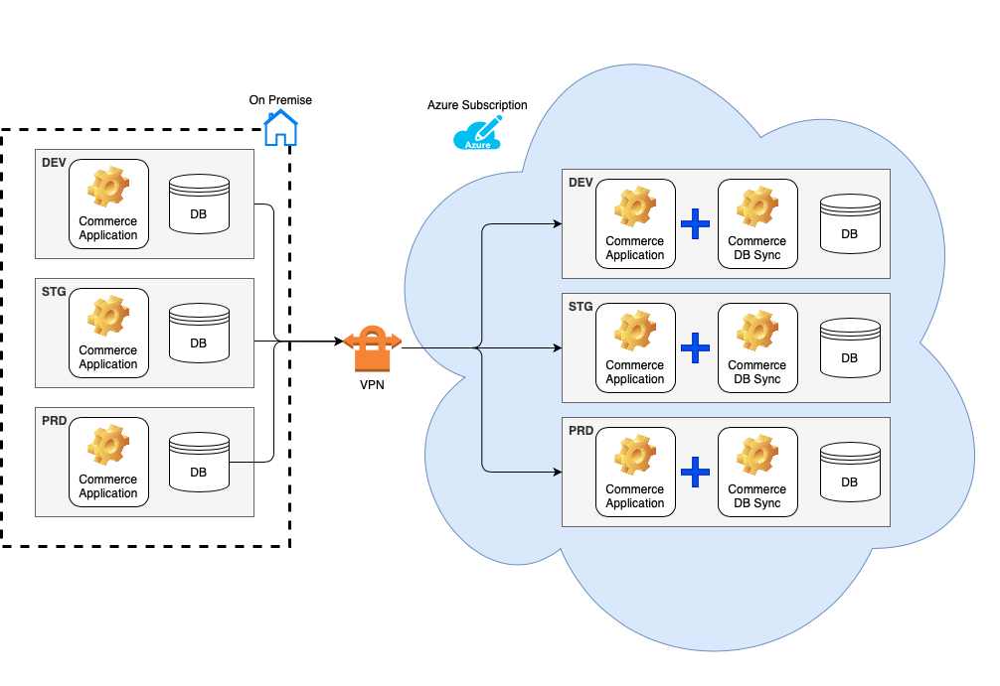
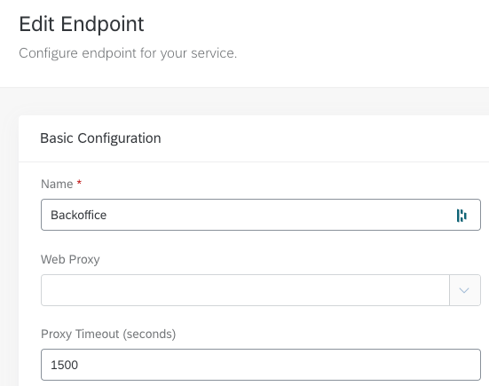
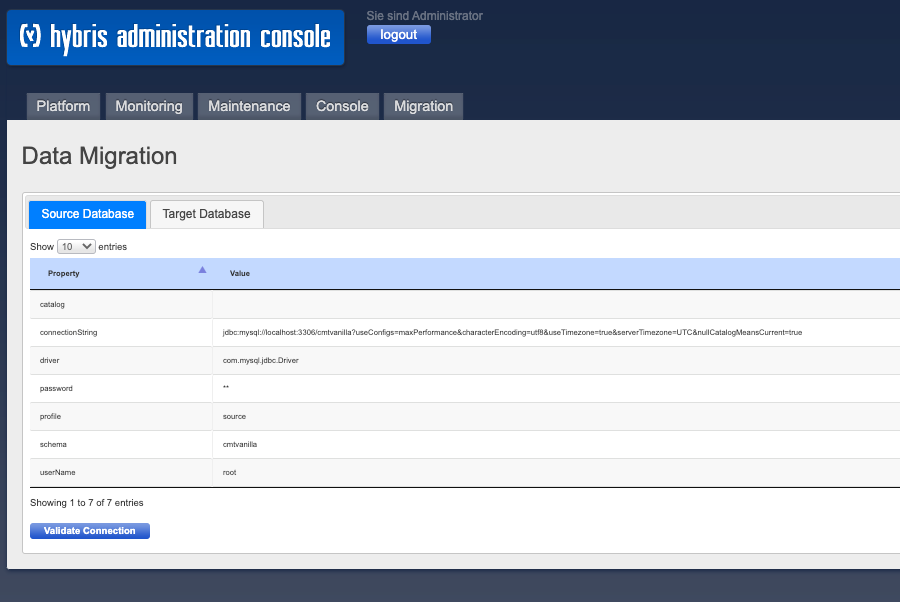
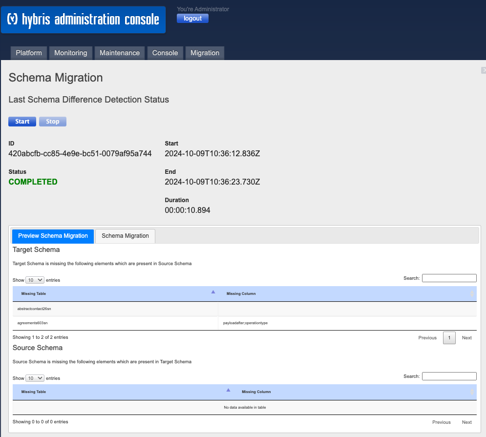
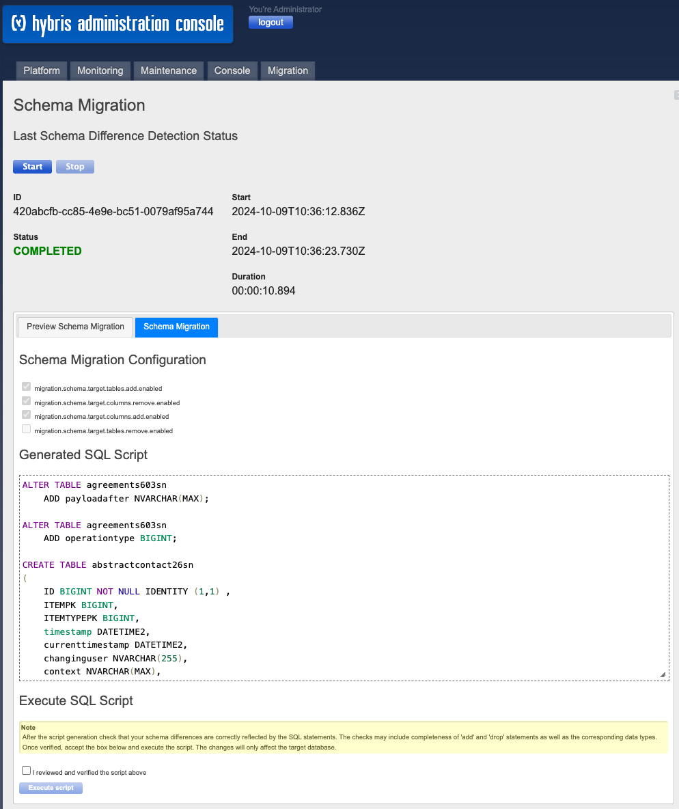
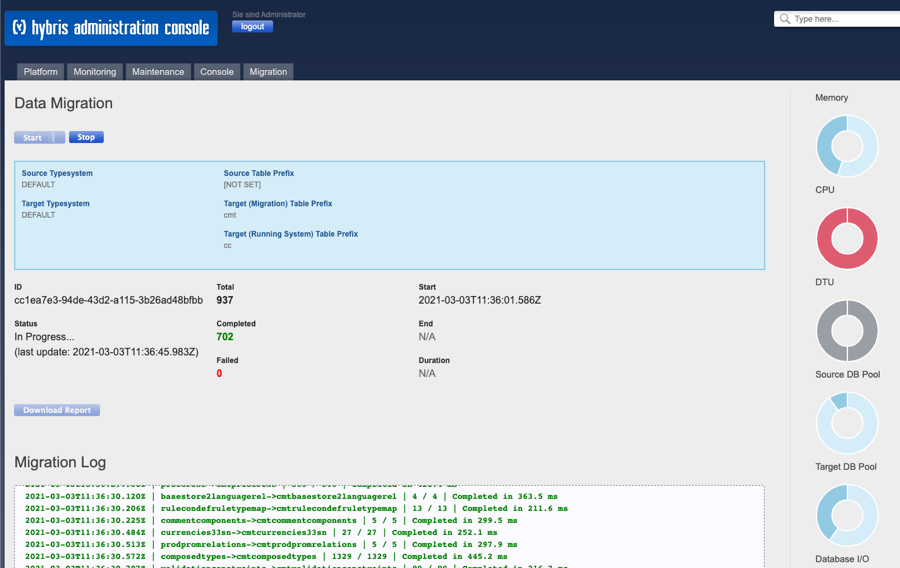
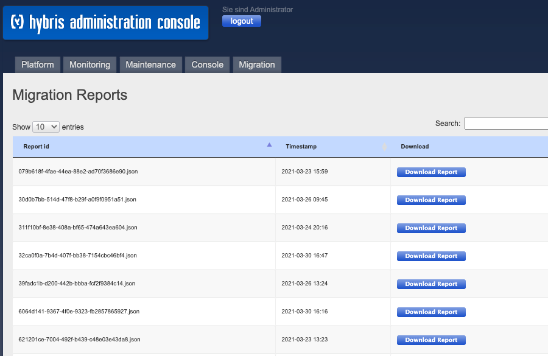

# Commerce DB Sync  - User Guide for Data Migration

Data migration use case is useful to migrate from SAP Commerce onPrem to SAP Commerce Cloud.



The tool can be used with three different approaches for migration:
1. Staged copy approach: this method allows you to use the SAP Commerce prefix feature to create a separate staged copy of your tables in the database. This way, while migrating, you can preserve a full copy of the existing database in your SAP Commerce Cloud subscription and migrate the data on the staged tables. When you are satisfied with the data copied in the staged tables, you can then switch the prefixes to shift your SAP Commerce installation to the migrated data. The main difference with the direct copy approach is in the configuration and usage of the prefixes within the extensions, and in terms of the cleanup at the end of the migration;
2. Direct copy approach: this method directly overwrites the data of your database in SAP Commerce Cloud;
3. Incremental approach: can be used after each of the previous approaches, to incrementally migrate some selected data. Please check the  [Configure incremental data migration](../configuration/CONFIGURATION-GUIDE.md) section

You can see more details below at [How to choose the best approach for my migration](#How-to-choose-the-best-approach-for-my-migration)

## Prerequisites
Carefully read the prerequisites and make sure you meet the requirements before you commence the migration. Some of the prerequisites may require code adaptations or database cleanup tasks to prepare for the migration, therefore make sure you reserve enough time so that you can adhere to your project plan.

Before you begin, ensure you have met the following requirements:

* Your code base is compatible with the SAP Commerce version required by SAP Commerce Cloud (at minimum).
* The code base on source and destination systems is adjusted according to the guidance from [blog](https://community.sap.com/t5/crm-and-cx-blogs-by-sap/migration-and-upgrade-understanding-key-approaches/ba-p/13902274) page. It includes:
  * platform version
  * custom extensions
  * set of configured extensions
  * type system definition as specified in \*-items.xml
* The attribute data types which are database-specific must be compatible with the target database
* Orphaned-types cleanup has been performed in the source system. Data referencing deleted types has been removed.
* The target system is in a state where it can be initialized and the data imported
* The source system is updated with the same \*-items.xml as deployed on the target system (ie. update system has been performed)
* The connectivity to the source database from SAP Commerce Cloud happens via a secured channel, such as the self-serviced VPN that can be created in SAP Commerce Cloud Portal. It is obligatory, and the customer's responsibility, to secure the data transmission
* Old type systems have been deleted in the source system
* A check for duplicates has been performed and existing duplicates in the source database have been removed
* The task engine has been disabled in all target nodes (task.engine.loadonstartup=false)


# Limitations

* The tool only copies over table data. Any other database features like 'views', stored procedures', 'synonyms' ... will be ignored.
* Only the database vendors mentioned in the Compatibility section are supported

## Install the extensions

To install SAP Commerce DB Sync, follow these steps:

Add the following extensions to your localextensions.xml:
```
<extension name="commercedbsync"/>
<extension name="commercedbsynchac"/>
```

> **NOTE**: For SAP Commerce Cloud make sure the extensions are actually being loaded by the manifest.json

Make sure you add the source/target DB driver to **commercedbsync/lib** if necessary. Use _external-dependencies.xml_ file for this, as 3rd party dependencies are managed by Maven.  

## Configure the extensions
Configure the extensions as needed in your **local.properties**. See the [Property Configuration Reference](../configuration/CONFIGURATION-REFERENCE.md).

Make sure that data replication mode is disabled:
```
migration.data.export.enabled=false
```

At least you have to configure the connection to your source database. Here is an example for mysql:

```
migration.ds.source.db.driver=com.mysql.jdbc.Driver
migration.ds.source.db.url=jdbc:mysql://[host]:3600/localdev?useConfigs=maxPerformance&characterEncoding=utf8&useTimezone=true&serverTimezone=UTC&nullCatalogMeansCurrent=true
migration.ds.source.db.username=[username]
migration.ds.source.db.password=[pw]
migration.ds.source.db.tableprefix=
migration.ds.source.db.schema=localdev
```

> **NOTE**: If you are not running in SAP Commerce Cloud (i.e locally) make sure the target database is MSSQL.

## Build and start the platform

Build and start the on-premise SAP Commerce platform.

For a local installation:
```
> ant all initialize && ./hybrisserver.sh
```

On SAP Commerce Cloud:

* Trigger a build and deploy to the respective environment with initialization (if not yet done).

For Staged copy approach, each table prefix requires an initialization first. Imagine the following example scenario:

* Commerce runtime uses the prefix 'cc'
* Data is being migrated to the prefix 'cmt'

For this, the system has to be initialized twice:
1. ```db.tableprefix = cc``` for first initialization
2. ```db.tableprefix = cmt``` for second initialization

Once finished, use the following properties to control which prefix is for the commerce runtime and which prefix is used to copy data to:
```
migration.ds.target.db.tableprefix = <prefix of the tables that are going to be copied in the target database>
db.tableprefix = <prefix of the tables of the current running system>
```
## Proxy Timeout
Some operations in the admin console may take more time to execute than the default proxy timeout in SAP Commerce Cloud allows.
To make sure you don't run into a proxy timeout exception, please adjust the value in your endpoint accordingly:



A value between 10 and 20 minutes should be safe. However, it depends on the components and systems involved.

> **IMPORTANT**: make sure to revert the value to either the default value or a value that suits your needs after completion of the migration.

## Establish a secure connection
It is mandatory to establish a secure connection between your on-premise and SAP Commerce Cloud environments. To do so, you can use the [self-service VPN feature from the SAP Cloud Portal](https://help.sap.com/viewer/0fa6bcf4736c46f78c248512391eb467/v2005/en-US/f63dfaed22d949ed9aadbb7835584586.html).

## Data Source Validation
After having established your secure connectivity, validate the source and target database connections. For this, open the HAC and go to Migration->Data Sources



## Check Schema Differences
Check if there are any schema differences. For this, open the HAC and go to Migration->Schema Migration. Trigger Schema Migration preview by clicking the "Start" button. Once completed, you will see a list of schema differences if any.



In case there are schema differences switch to the right tab and review generated sql script used to adjust the target schema.



If you think it is all fine, make sure to tick "I reviewed and verified the script above" checkbox.

## Copy Schema
After you have analysed all the schema differences and understood what data you want to migrate, you can use the "Execute Script" button to modify the target SAP Commerce Cloud schema and make it equivalent to the source schema. Please note, this operation executes the following in the target schema:
* Create tables
* Add/drop columns to existing tables

In the event of a staged copy approach, the system detects how many stage tables already exist in the target database. If this number exceeds pre-defined config parameter value:
`migration.ds.target.db.max.stage.migrations` (by default set to 5),
there will be numerous queries generated that removes all tables and indexes corresponding with the identified staged tables. Please note, that current schema stays untouched so as to not disrupt your system.
When the system does not detect any more stage tables, you should see queries creating new tables respectively.

> **NOTE**: no changes are made to the source database.

## Start the Data Migration
Start the data migration. For this, open the HAC and go to Migration->Data Migration. Click on "Copy Source Data" to start the migration.



The migration progress will be displayed in the HAC. It also shows some useful performance metrics:
* Current memory utilisation
* Current cpu utilisation
* Current DTU utilisation (if available)
* Current source and target db pool consumption
* Current I/O (rows read / written)

Check the console output for further migration progress information, i.e.:
```
...
INFO  [hybrisHTTP7] [CustomClusterDatabaseCopyScheduler] Node {0}. Migration-ID {1814262805}. {mediaformatlp->mediaformatlp} finished in {513.6 ms}...
INFO  [hybrisHTTP7] [CustomClusterDatabaseCopyScheduler] Node {0}. Migration-ID {1814262805}. {bundletemplatestatus->bundletemplatestatus} finished in {440.8 ms}...
INFO  [hybrisHTTP7] [CustomClusterDatabaseCopyScheduler] Node {0}. Migration-ID {1814262805}. {cxusertosegment->cxusertosegment} finished in {1.644 s}...
INFO  [hybrisHTTP7] [CustomClusterDatabaseCopyScheduler] Node {0}. Migration-ID {1814262805}. {triggerscj->triggerscj} finished in {410.8 ms}...
INFO  [hybrisHTTP7] [CustomClusterDatabaseCopyScheduler] Node {0}. Migration-ID {1814262805}. {droolskiebase->droolskiebase} finished in {303.5 ms}...
INFO  [hybrisHTTP7] [CustomClusterDatabaseCopyScheduler] Node {0}. Migration-ID {1814262805}. {306 of 306} tables migrated...
INFO  [hybrisHTTP7] [CustomClusterDatabaseCopyScheduler] Node {0}. Migration-ID {1814262805}. Tables migration took {25.57 s}...
```
> **NOTE**: The process will only take into consideration the intersection of the source and target tables. Tables that are in the source schema, but not in the target schema (and vice versa), will be ignored.

## Verify the migrated data
Check the UI to verify that all tables have been copied successfully. All the logs from the migration will be available in the Kibana interface. At the end of the data copy, you can find a report in the HAC and there will be a button available, enabling you to download the report.



## Start the Media Migration
While you are migrating the database, use the process described in the [azcopy cxworks](https://www.sap.com/cxworks/article/508629017/migrate_to_sap_commerce_cloud_migrate_media_with_azcopy) article to migrate your medias.

## Perform update running system
After both the database and media migrations are completed, perform an update running system. Do not skip this step as this is fundamental for the correct SAP Commerce Cloud functioning.

### Direct approach
For a local installation:
```
> ant updatesystem
```

On SAP Commerce Cloud:

Execute a deployment with data migration mode "Migrate Data" (equivalent to system update).

### Staged approach

If you were using the staged approach, simply navigate to your properties file and invert the two prefixes configured at the beginning:
```
migration.ds.target.db.tableprefix = <current db.tableprefix value>
db.tableprefix = <current migration.ds.target.db.tableprefix value>
```
Execute a deployment with data migration mode "Migrate Data" (equivalent to system update).

If you want to remove the set of pre-existing tables, you can:
* generate SQL schema scripts once again (the system will detect some staged tables, see property 'migration.ds.target.db.max.stage.migrations'). You can review such a script and run it by clicking the "Execute script" button;
* open a ticket to request SAP to remove such tables.

## Test the migrated data

Execute thorough testing on the migrated environment to ensure data quality. The data is copied in a one-to-one method, from the source database. So there might be some adjustments needed after the copy process. Some examples of adjustments can be, data sorted in the database that refers to particular parts of the infrastructure that might have changed in SAP Commerce Cloud (e.g. Solr references, Data Hub references, etc...). Also the passwords are migrated in a one-to-one fashion, if in your source system you have changed the default encryption key. Please reference the section "Key Management and Key Rotation" of [this guide](https://help.sap.com/viewer/d0224eca81e249cb821f2cdf45a82ace/2005/en-US/8b2c75c886691014bc12b8b532a96f58.html) to align it in SAP Commerce Cloud.

## How to choose the best approach for my migration

Staged copy approach:
* By having a separate migration prefix, the code base in SAP Commerce Cloud differentiates itself with the one on-premise by allowing you to be more flexible in terms of executing an upgrade and migration at the same time. This is only valid until you switch the prefixes, so be sure to have executed thorough testing before doing this;
* The original prefix tables can always be used as a safe rollback in case of issues;
* This approach is recommended to ensure that you do not lose any data in the target system

Direct copy approach:
* This approach can be used when you are very sure about the successful execution of the data migration and are ok with potentially having to re-initialize the system in case of problems.

Incremental approach:
* This should be used when the requirement for a short cutover time is critical and, for the tables that are not selected as part of the incremental migration, it is acceptable to either introduce some data freeze or ignore data changes after the initial bulk copy;
* This approach can be used on top of both the staged copy and direct copy approach.
