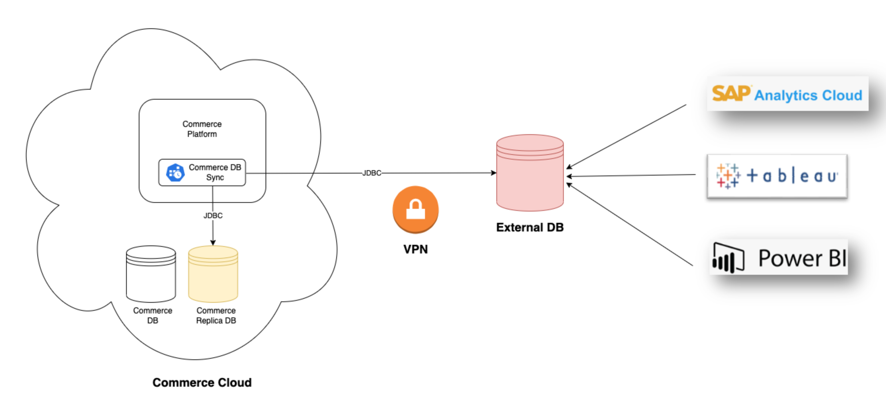

# Commerce DB Sync - User Guide for Data Replication

It allows you to synchronize the data you select single-directionally (from CCV2) across an external database (either hosted on-Premise or on Public Cloud).

This external database can then be used for analytics and reporting purpose.



It provides the following features:

* The Sync Schema describes which data(table/items) is being synchronized.
* The Sync Direction is only single-directional, which is from CCV2 to Onprem or another cloud MS Database.
* The Sync Interval describes how often synchronization occurs.

## Methodology for Data Sync

* Identify the tables you would like to sync (limit to the minimum that is required and avoid large tables when possible). Ex: do not sync task logs!
* Define a strategy to manage deletion if required, see **Support for deletion** section 
* Remove/Add indexes that are not necessary in the target db
* Create indexes on last modified timestamp for tables that supports incremental
* Full data migration with all tables
* Run incremental regularly (example every hour)
* Reconfigure full data migration cronjob to sync tables with no last modified timestamp
* Run full data migration cronjob regularly and during low activity (e.g. every day, 3PM) - this is to resolve any potential integrity issue during the regular incremental
* Ensure data migration cronjobs are running on the read-only database

## Limitations to consider with Data Sync

The following limitations should be considered when implementing Commerce DB sync for data sync use case:
* Not all Commerce tables contain last modified timestamp
   * It will usually the case in SAP Commerce for system tables (ex: PROPS, AUDIT_LOGS,…)
   * There is an additional feature in SAP Commerce DB sync to support incremental migration for ***LP*** system table.
   * Other system tables will be usually relatively small and can be full sync each time
   * You should ensure you do not have any large table that does not contain timestamp
* Incremental update may create data integrity issue between two runs
   * During the cronjob execution, you may have some updates or creations that are not sync
   * There is no guaranty that some tables with relations may be partially sync, example Orders vs Orders items,
   * This should be acceptable for reporting or analytics use cases but it should be take into consideration for the application using the destination DB)
* Sync of master data (tables without last modified timestamp) may be delayed (e.g. 24 hours)
* Particular challenges comes with deletion managemement with incremental data sync and a strategy needs to be defined, see **Support for deletion** section
* Performance should be tested to tune batch size and number threads (memory and CPU on the application server)

## Support for deletion

SAP Commerce DB Sync does support deletions. It it can be enabled for the transactional table using two different approaches:
- Default Approach using After Save Event Listener
- Alternative approach using Remove Interceptor

See [Deletion Support](./SUPPORT-DELETE-GUIDE.md).

## Installation and Setup

### Install SAP Commerce DB Sync on your source system

- Add the following extensions to your **localextensions.xml**:
```
<extension name="commercedbsync"/>
<extension name="commercedbsynchac"/>
```
- Execute system update

### Configure SAP Commerce DB Sync

[Configuration Reference](../configuration/CONFIGURATION-REFERENCE.md) To get a high-level overview of the configurable properties by Commerce Database Sync.

Properties require to reconfigure or readjusted for Data Sync.

| Property                                               | Mandatory | Default                                                          | Description                                                                                                                                                                                                                                                                                        |
|--------------------------------------------------------|-----------|------------------------------------------------------------------|----------------------------------------------------------------------------------------------------------------------------------------------------------------------------------------------------------------------------------------------------------------------------------------------------|
| migration.data.export.enabled                          | yes       | true                                                             | Activates data replication mode. Standard migration is not possinble in this state                                                                                                                                                                                                                 |
| migration.ds.source.db.url                             | yes       |                                                                  | DB url for source connection , default value should be **${db.url};ApplicationIntent=ReadOnly** ApplicationIntent can be adjusted or removed for local testing                                                                                                                                     |
| migration.ds.source.db.schema                          | no        | dbo                                                              | DB schema for source connection                                                                                                                                                                                                                                                                    |
| migration.ds.target.db.driver                          | yes       | ${db.driver}                                                     | DB driver class for target connection                                                                                                                                                                                                                                                              |
| migration.ds.target.db.username                        | yes       |                                                                  | DB username for target connection                                                                                                                                                                                                                                                                  |
| migration.ds.target.db.password                        | yes       |                                                                  | DB password for target connection                                                                                                                                                                                                                                                                  |
| migration.ds.target.db.tableprefix                     | no        | ${db.tableprefix}                                                | DB table prefix for target connection                                                                                                                                                                                                                                                              |
| migration.ds.target.db.schema                          | no        | dbo                                                              | DB schema for target connection                                                                                                                                                                                                                                                                    |
| migration.internal.tables.storage                      | no        |                                                                  | Specifies where to store the internal tables (source or target). If empty and migration.data.export.enabled is true, then it is set to "target", otherwise "source"                                                                                                                                |
| migration.data.tables.included                         | no        |                                                                  | Tables to be included in the migration. It is recommended to set this parameter during the first load of selective table sync, which will allow you to sync directly from HAC along with Schema. Eventually you can do very similar with full migration cron jobs by adjusting the list of tables. |
| migration.data.report.connectionstring                 | yes       | ${media.globalSettings.cloudAzureBlobStorageStrategy.connection} | Target blob storage for the report generation, although you can replace with Hotfolder Blob storage ${azure.hotfolder.storage.account.connection-string}                                                                                                                                           |
| migration.data.workers.retryattempts                   | no        | 0                                                                | Retry attempts if a batch (read or write) failed.                                                                                                                                                                                                                                                  |

## CronJob Configuration reference Data Sync

Commerce DB Sync for data replication is managed by Cronjobs which allow you to trigger full and regular sync based on sync interval.

Following High-level details for the Cronjobs,
#### FullMigrationCronJob
It allows you to sync the full based on the list provided in CronJob settings.
List of attributes/properties can set during Full migration

| attributes                                               | Mandatory | Default                                                                                                                                                                      | Description                                                                                              |
|--------------------------------------------------------|-----------|------------------------------------------------------------------------------------------------------------------------------------------------------------------------------|----------------------------------------------------------------------------------------------------------|
| migrationItems                                         | yes       |                                                                                                                                                                              | Initially it can be set through impex file, and later it Adjusted through either Backoffice or Impex. You can set list of table with required full sync during initials, later adjust based on business case.                                                                               |
| schemaAutotrigger                                      | no        |  false                                                                                                                                                                       | Adjust this value if you have any Data model changes, it can be changed to true, but it will add delay in every sync.                                                                             |
| truncateEnabled                                        | yes       |  false                                                                                                                                                                       | Allow truncating the target table before writing data which is mandatory for the Full Sync, set **true** for full Sync                                                                        |
| cronExpression                                        | yes       |   0 0/1 * * * ?                                                                                                                                                                | Set via impex file                                                                      |

#### IncrementalMigrationCronJob
It allows you to sync the delta based on modifiedTS hence tables must have the following columns: modifiedTS, PK. Furthermore, this is an incremental approach... only modified and inserted rows are taken into account. Deletions on the source side are not handled.

List of attributes/properties can set during incremental migration

| attributes                                               | Mandatory | Default                                                                                                                                                                      | Description                                                                                              |
|--------------------------------------------------------|-----------|------------------------------------------------------------------------------------------------------------------------------------------------------------------------------|----------------------------------------------------------------------------------------------------------|
| migrationItems                                         | yes       |                                                                                                                                                                              | Initially it can be set through impex file, and later it Adjusted through either Backoffice or Impex.   |
| schemaAutotrigger                                      | no        |  false                                                                                                                                                                       | Adjust this value if you have any Data model changes, it can be changed to true, but it will add delay in every sync.                                                                             |
| truncateEnabled                                        | yes       |  false                                                                                                                                                                       | Set **false** for incremental sync                                                                          |
| cronExpression                                         | yes       |   0 0 0 * * ?                                                                                                                                                                | Set via impex file                                                                      |
| lastStartTime                                         | yes       |                                                                                                                                                                  | Its updated based last triggered timestamp. Update manually for longer window.                                                                     |

_**Note:**_ It's better to create separate Cronjobs for Language(LP) and non Language tables. The frequency of updates for the LP table is much lesser than Non-LP.

#### Default Impex file
```
INSERT_UPDATE ServicelayerJob;code[unique=true];springId[unique=true]
;incrementalMigrationJob;incrementalMigrationJob
;fullMigrationJob;fullMigrationJob

# Update details for incremental migration
INSERT_UPDATE IncrementalMigrationCronJob;code[unique=true];active;job(code)[default=incrementalMigrationJob];sessionLanguage(isoCode)[default=en]
;incrementalMigrationJobNonLP;true;
;incrementalMigrationJobLP;true;

INSERT_UPDATE IncrementalMigrationCronJob;code[unique=true];migrationItems
;incrementalMigrationJobNonLP;PAYMENTMODES,ADDRESSES,users,CAT2PRODREL,CONSIGNMENTS,ORDERS
;incrementalMigrationJobLP;validationconstraintslp,catalogslp

INSERT_UPDATE FullMigrationCronJob;code[unique=true];active;job(code)[default=fullMigrationJob];sessionLanguage(isoCode)[default=en]
;fullMigrationJob;true;

INSERT_UPDATE FullMigrationCronJob;code[unique=true];truncateEnabled;migrationItems
;fullMigrationJob;true;PAYMENTMODES,products

INSERT_UPDATE Trigger;cronjob(code)[unique=true];cronExpression
#% afterEach: impex.getLastImportedItem().setActivationTime(new Date());
;incrementalMigrationJobLP; 0 0/1 * * *
;incrementalMigrationJobNonLP; 0 0 0 * * ?
;fullMigrationJob; 0 0 0 * * ?
```

